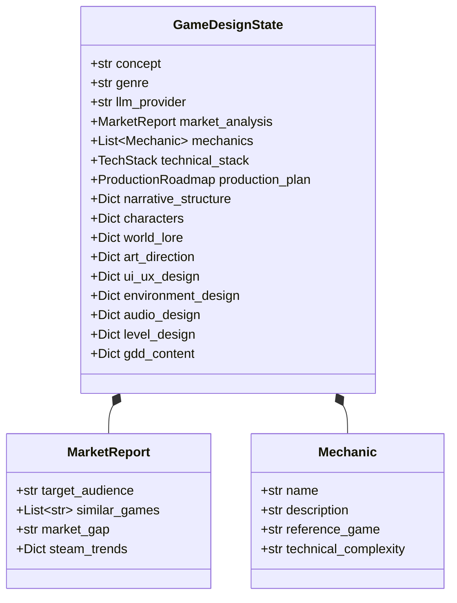
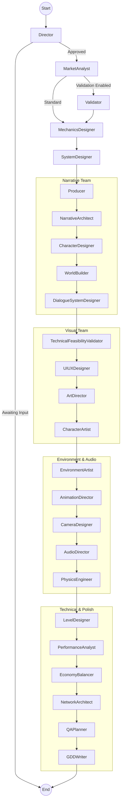

# 🏗️ LUDEX Framework: Architecture & Data Flow

This document details the internal logic, data flow, and state management of the LUDEX Framework. It serves as a reference for understanding how the 24-agent "Spiral" workflow operates, particularly under the **Mock LLM** testing environment.

---

## 1. 🧠 Global State Schema (`GameDesignState`)

The `GameDesignState` is the shared "blackboard" that all agents read from and write to. It is defined in `core/state.py`.



---

## 2. 🔄 Graph Topology

The system uses a directed graph architecture (LangGraph) with conditional routing.



---

## 3. 🧩 Node Logic & Data Flow

Each node represents an AI Agent. Below is the logic for key nodes, specifically highlighting the **Mock LLM** behavior for testing consistency.

### 🎬 Director
*   **Role**: Clarifies the user's initial concept.
*   **Input**: `concept`, `genre`, `messages`
*   **Output**: `refined_concept`, `production_mode`, `awaiting_input`
*   **Mock Behavior**:
    *   Returns `status: "ready"` and a `refined_concept`.
    *   Simulates user approval to proceed to the next step.

### 📊 Market Analyst
*   **Role**: Analyzes competitors and target audience.
*   **Input**: `refined_concept`, `genre`
*   **Output**: `market_analysis` (MarketReport)
*   **Mock Response**:
    ```json
    {
      "competitive_analysis": {
        "similar_games": [{"title": "Dark Souls III", ...}],
        "market_saturation": "MEDIUM"
      },
      "target_audience": {
        "primary_demographic": "18-35 male PC/Console gamers"
      },
      "recommendation": "GREEN_LIGHT"
    }
    ```

### ⚙️ Mechanics Designer
*   **Role**: Defines core loops and gameplay mechanics.
*   **Input**: `refined_concept`, `market_analysis`
*   **Output**: `mechanics` (List[Mechanic])
*   **Mock Response**:
    ```json
    {
      "core_loop": "Explore -> Encounter -> Combat -> Die/Learn",
      "mechanics": [
        {"name": "Stamina-Based Combat", "priority": "CORE"},
        {"name": "Checkpoints (Bonfires)", "priority": "CORE"}
      ]
    }
    ```

### 🛠️ System Designer
*   **Role**: Recommends engine and technical stack.
*   **Input**: `mechanics`, `genre`
*   **Output**: `technical_stack` (TechStack)
*   **Mock Response**:
    ```json
    {
      "engine": "Unreal Engine 5",
      "language": "C++",
      "critical_packages": ["Gameplay Ability System", "Enhanced Input"],
      "feasibility": "HIGH"
    }
    ```

### 📅 Producer
*   **Role**: Estimates budget, timeline, and risks.
*   **Input**: `mechanics`, `technical_stack`
*   **Output**: `production_plan` (ProductionRoadmap)
*   **Mock Response**:
    ```json
    {
      "total_timeline": {"months": 18},
      "budget_estimate": {"total_range": "$200K-350K"},
      "team_composition": {"ideal_size": 6},
      "milestones": ["Vertical Slice", "Alpha", "Beta", "Gold"]
    }
    ```

### 📖 Narrative Architect
*   **Role**: Defines story structure and themes.
*   **Input**: `refined_concept`
*   **Output**: `narrative_structure`
*   **Mock Response**:
    ```json
    {
      "narrative_framework": "Environmental Storytelling",
      "protagonist": {"name": "The Engineer", "motivation": "Uncover truth"},
      "antagonist": {"name": "The Mechanist", "motivation": "Transcend flesh"},
      "themes": ["Man vs Machine", "Gothic Horror"]
    }
    ```

### 🎨 Art Director
*   **Role**: Defines visual style and color palettes.
*   **Input**: `narrative_structure`, `genre`
*   **Output**: `art_direction`
*   **Mock Response**:
    ```json
    {
      "art_style": "Cyberpunk",
      "color_palette": ["Neon Blue", "Dark Grey"],
      "visual_pillars": ["High Contrast", "Industrial Decay"]
    }
    ```

### 📝 GDD Writer
*   **Role**: Compiles all state into a final Markdown document.
*   **Input**: *All State Fields*
*   **Output**: `gdd_content`
*   **Mock Behavior**:
    *   Generates a structured Markdown string summarizing the Mock data from previous steps.

---

## 4. 🧪 Testing with Mock LLM

To verify data consistency:

1.  **Select Provider**: Go to Settings -> Provider -> **Mock LLM (Testing)**.
2.  **Trigger Generation**: Enter a concept (e.g., "Cyberpunk RPG") and click Start.
3.  **Verify Output**:
    *   Check **Agent Status**: All agents should turn Green (Done) sequentially.
    *   Check **Activity Stream**: Ensure JSON outputs match the schemas above.
    *   Check **GDD Preview**: The final document should be coherent and contain sections from all agents.
    *   Check **System Logs**: Verify no `KeyError` or validation errors in the logs.

This architecture ensures that even without real LLM calls, the **structure** and **flow** of data can be rigorously tested and validated.
